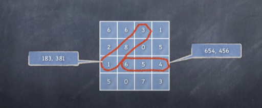
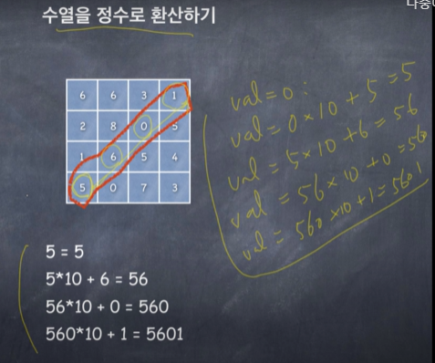
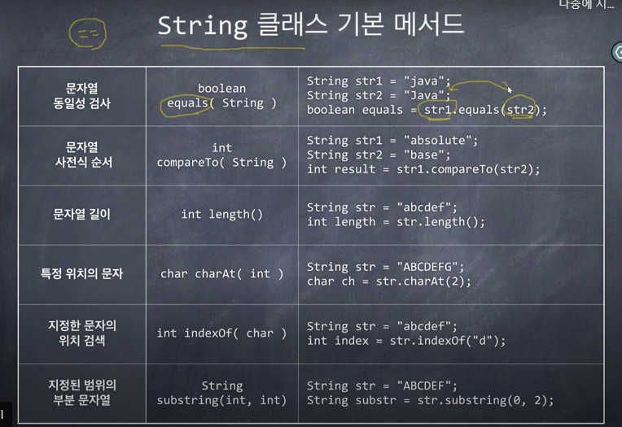

# Java로 배우는 자료구조

## 변수, 배열 , 반복문

- [설명](src/com/company/study/structure01_array/배열-반복문-변수.md)
- [배열의최댓값,최소값](src/com/company/study/structure01_array/Code03.java)
- [배열 값 한칸씩 이동](src/com/company/study/structure01_array/Code04.java)
- [솟수구하기](src/com/company/study/structure01_array/Code05.java)
- [버블정렬](src/com/company/study/structure01_array/Code09.java)

## 메서드 호출과 프로그램의 기능적 분할

- [거듭제곱](src/com/company/study/structure02_method/Code11.java)
- [소수 구하기](src/com/company/study/structure02_method/Code12.java)
- [버블정렬](src/com/company/study/structure02_method/Code13.java)
- [버블정렬-값에의한 호출](src/com/company/study/structure02_method/값에의한호출.md)
- [primitive 타입여부에 따른 차이](src/com/company/study/structure02_method/Code13_3.java)
- [파일에서 데이터 가져오기](src/com/company/study/structure02_method/Code14.java)
- [문자열 버블정렬](src/com/company/study/structure02_method/Code15.java)

#### 2차원 배열에서 소수 찾기
`강의 : 메서드 호출과 프로그램의 기능적 분할(4/4)`

 입력으로 n*n개의 음이 아닌 한자리 정수가 그림과 같이 주어진다. 이 정수들 중
가로, 세로, 대각선의 8방향으로 연속된 숫자들을 합쳐서(?) 만들 수 있는 모든
소수를 찾아서 나열하는 프로그램을 작성하라. 중복된 수를 출력해도 상관없다.

배열을 정수로 환산하기

## 문자열 다루기

#### 인덱스 메이커

- 입력으로 하나의 텍스트 파일을 읽는다(sample.txt)
- 텍스트 파일에 등장하는 모든 단어들의 목록을 만들고, 각 단어가 텍스트 파일에
등장하는 횟수를 센다. 단, 단어 개수는 100,000개 이하라고 가정한다.

- 사용자가 요청하면 단어 목록을 하나의 파일로 저장한다.
- 사용자가 단어를 검색하면 그 단어가 텍스트 파일에 몇 번 등장하는지 출력한다.

