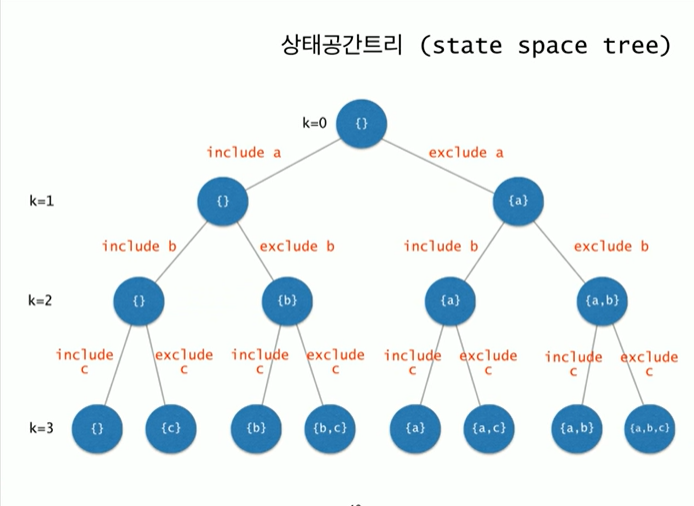

# powerset

- 임의의 집합 data이 모든 부분집합을 출력하라

부분집합 갯수  n -> 2^n


{a,b,c,d,e,f}의 모든 부분집합을 나열하려면 
- a를 제외한 {b,c,d,e,f}의 모든 부분집합들을 나열하고
- {b,c,d,e,f}의 모든 부분집합에 {a}를 추가한 집합들을 나열한다.

{b,c,d,e,f}의 모든 부분집합에 {a}를 추가한 집합들을 나열하려면
- {c,d,e,f}의 모든 부분집합들에 {a}를 추가한 집합들을 나열하고
- {c,d,e,f}의 모든 부분집합에 {a,b}를 추가한 집합들을 나열한다.

{c,d,e,f}의 모든 부분집합에 {a}를 추가한 집합들을 나열하려면
- {d,e,f}의 모든 부분집합들에 {a}를 추가한 집합들을 나열하고
- {d,e,f}의 모든 부분집합에 {a,c}를 추가한 집합들을 나열한다.





```java

public class Code01 {
    private static char data[] = {'a','b','c','d','e','f'};
    private static final int N = data.length;
    private static boolean [] include = new boolean[N];

    public static void powerSet(int k){
        if (k==N){
            for (int i=0; i<k; i++){
                if (include[i]){
                    System.out.print(data[i]+" ");
                }
            }
            System.out.println();
            return;
        }else{

            include[k] =false;
            powerSet(k+1);
            include[k] = true;
            powerSet(k+1);
        }
    }

    public static void main(String[] args) {
        powerSet(0);
    }
}

```