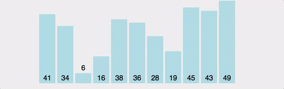
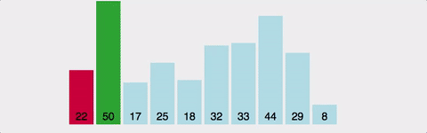
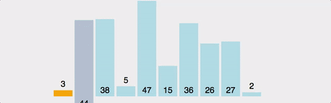

# 정렬 알고리즘

- Bubble sort
- Insertion sort
- Selection sort
- Quicksort
- Merge sort
- Heap sort
- Radix sort

## 기본적인 정렬 알고리즘

각 루프마다 최대 원소를 찾는다.

최대 원소와 맨 오른쪽 원소를 교환한다.

맨 오른쪽 원소를 제외한다.

하나의 원소만 남을 때까지 위의 루프를 반복


## 1.버블정렬(Bubble sort)
버블정렬은 가장 쉬운 정렬 알고리즘이지만 시간복잡도가 좋은 퍼포먼스를 내지 못해서 실제로는 잘 사용되지 않는다.
시간복잡도는 O(n²)이며 공간복잡도는 하나의 배열만 사용하여 정렬을 진행하기 때문에 O(n)이다.



```java

public class BubbleSort {

    public static int[] bubbleSort(int arr[]){
        for (int i=0; i<arr.length-1; i++){
            for (int j=0; j< arr.length-i-1; j++){
                if (arr[j] > arr[j+1]){
                    int temp = arr[j+1];
                    arr[j+1] = arr[j];
                    arr[j] = temp;
                }
            }
        }
        return arr;
    }

    public static void main(String[] args) {
        int arr[] = {29,10,14,37,13};
        for (int c : arr){
            System.out.print(c+" ");
        }
        bubbleSort(arr);
        System.out.println();
        for (int x : arr){
            System.out.print(x+" ");
        }

    }
}

```

## 2. 선택정렬(Selection sort)
   선택정렬은 시간복잡도가 O(n²)으로 버블정렬과 정렬하는 알고리즘이 버블정렬과 유사하다. 
   한번 순회를 하면서 가장 큰 수를 찾아서 배열의 마지막 위치와 교환한다.




```java

public class SelectionSort {

    public static int[] SelectionSort(int arr[]){
        int j;
        for (int i=0; i< arr.length-1; i++){
            int min_index = i;

            for (j=i+1; j<arr.length; j++){
                if (arr[min_index] > arr[j]){
                    min_index =j;
                }
            }

            int temp = arr[min_index];
            arr[min_index] = arr[i];
            arr[i] = temp;

        }
        return arr;
    }
    public static void main(String[] args) {
        int arr[] = {29,10,14,37,13};
        for (int x : arr){
            System.out.print(x+" ");
        }
        SelectionSort(arr);
        System.out.println();
        for (int x : arr){
            System.out.print(x+" ");
        }

    }
}

```

## 3. 삽입정렬(Insertion Sort)
   삽입정렬은 1부터 n까지 Index를 설정하여 현재위치보다 아래쪽을 순회하며 현재위치의 값을 
   현재위치보다 아래쪽으로 순회하며 알맞은 위치에 넣어주는 정렬알고리즘이다.
   삽입정렬은 이미 정렬이 되어있다면 O(n)의 시간복잡도를 가지게된다. 
   정렬이 되어있는 경우라면 한번 순회하며 체크만 하기 때문이며 Big-O 시간복잡도는 O(n²)이다.



