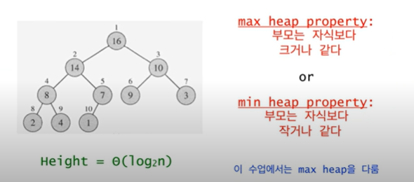
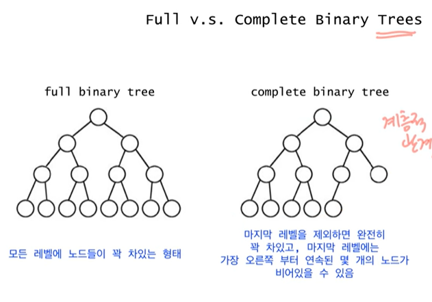
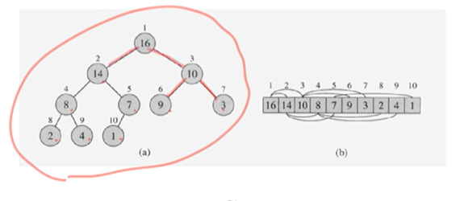
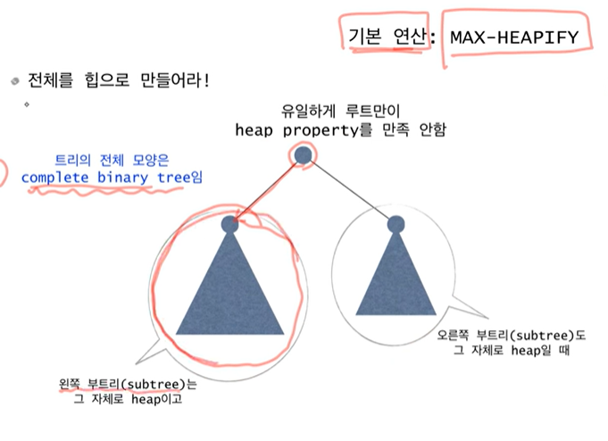
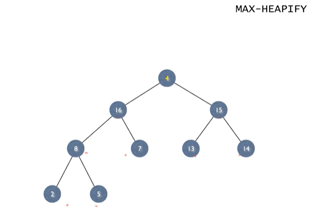
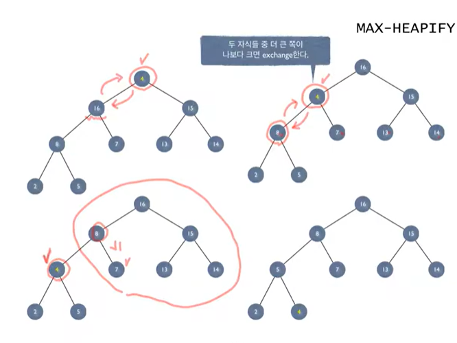

# 힙정렬

- 최악의 경우 시간복잡도 n*log(n)
- Sorts in place - 추가 배열 불필요
- 이진 힙(binary heap) 자료구조를 사용

## Heap의 정의

- Heap은 complete binary tree이면서 heap property를 만족해야

## Full vs Complete Binary Trees

- 힙은 일차원 배열로 표현가능 : A[1..n]
    - 루트 노드 A[1].
    - A[i]의 부몸 = A[i/2]
    - A[i]의 왼쪽 자식 = A[2i]
    - A[i]의 오른쪽 자식 = A[2i+1]
    

루트 만 힙을 만족하지 않는다.  - MAX-HEAPIFY

두 자식증 더 큰쪽이 나보다 크면 exchange 한다.

