# 정렬할 배열을 힙으로 만들기

배열 [4,1,3,2,16,9,10,14,8,7]

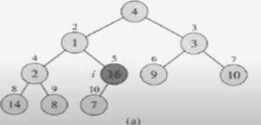

레벨 오더의 역순 , 오른쪽에서 왼쪽으로

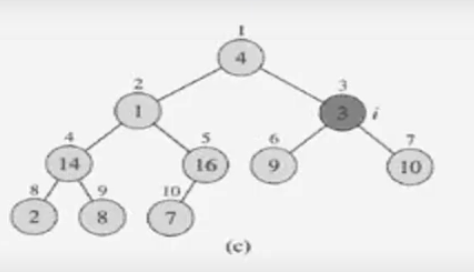

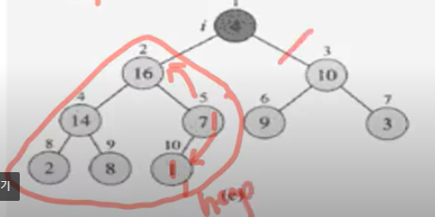

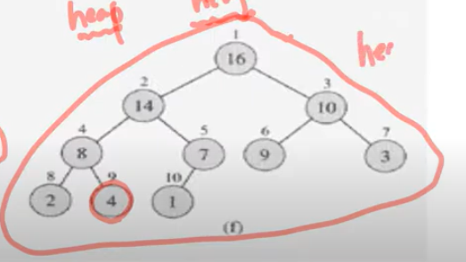

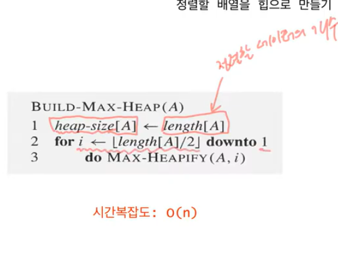

## 배열 [2,8,6,1,10,15,3,12,11]을 힙으로 만드는 과정

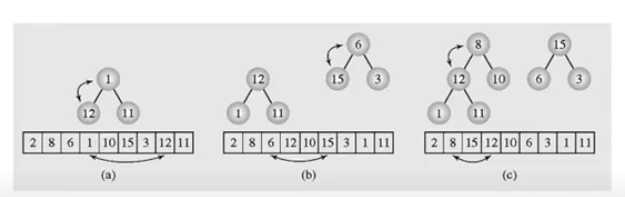

n = 9   n/2 = 4

4번은 배열의 1이고 4번의 왼쪽 자식은 8번의 12이고 오른쪽 자식은 9번의 11이다.

그 다음(1까지 반복) 3번은 값이 6  이고 왼쪽 자식 6번은 값은 15 , 오른쪽 자식 7번의 값은 3이다.

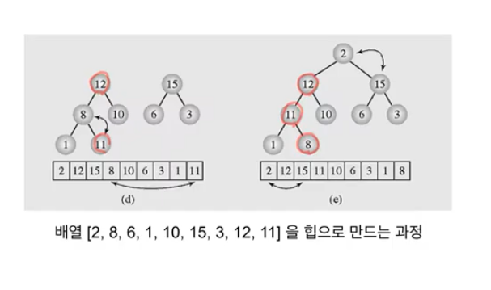

### HeapSort

- 주어진 데이터로 힙을 만든다.
- 힙에서 최대값(루트)을 가장 마지막 값과 바꾼다.
- 힙의 크기가 1 줄어든 것으로 간주한다. 즉 ,가장 마지막 값은 힙의 일부가 아닌 것으로 간주한다.
- 루트노드에 대해서 HEAPIFY(1)한다.
- 2~4번을 반복한다. 

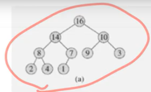

루트인 16과 가장 마지막 값인 1을 교환한다. , 마지막 값은 없는 것으로 간주  -> 힙의 크기가 1 줄어든 것으로 간주

그리고 HEAPIFY 과정을 거친다. 1, 14,8, 4 자리가 바뀐다.

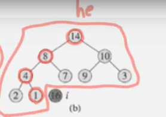

그리고 또 루트인 14와 가장 마지막 값인 1을 교환하고

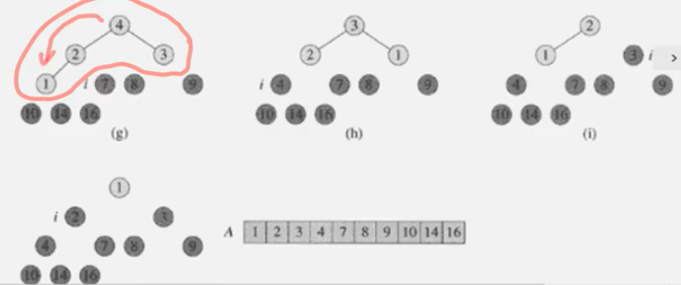

위의 과정을 반복하면

정렬된 배열이 된다.

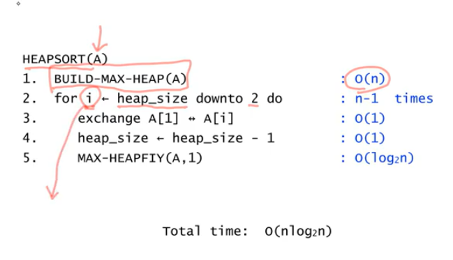