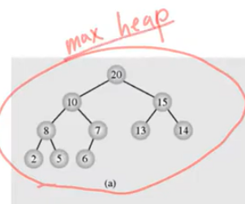
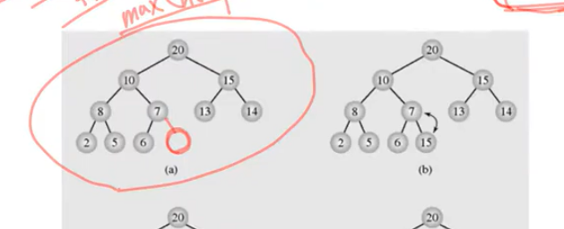
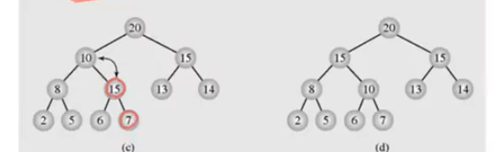
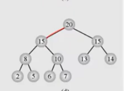
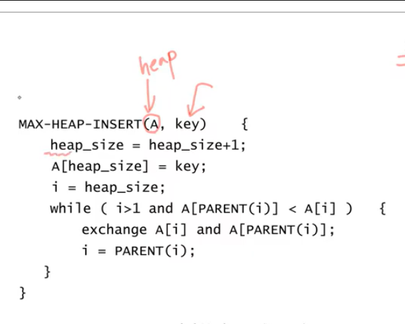

# 힙(heap)의 다른 응용 : 우선순위 큐(priority queue)

- 최대 우선순위 큐(maximum priority queue)는 다음 두 가지 연산을 지원하는 자료구조
    - INSERT(x) : 새로운 원소 x를 삽입
    - EXTRACT_MAX() : 최대값을 삭제하고 반환
    
- 최소 우선순위 큐(minimum priority queue)는 EXTRACT-MAX 대신 EXTRACT-MIN을 지원하는
자료구조
  
- MAX HEAP을 이용하여 최대 우선순위 큐를 구현
  
  

complete binary tree를 유지하려면 7번 값의 오른쪽 자식 노드에 새로운 값이 추가 되어야 한다.

마지막 노드에 15값을 추가했다. complete binary tree 조건은 맞지만 , max heap 이 아니다.

부모인 7과 오른쪽 자식 15를 교환 해주면 왼쪽 자식 6은 고려 할 필요가 없다.

애초에 max heap property 이면 부모 7이 자식보다 크기 때문에
더 큰 값인 15와 교환하면 문제가 발생하지 않는다.

레벨이 올라가도 마찬가지다 . 부모인 10은 왼쪽 자식 8보다 크다
여기서 10보다 더 큰 15와 교환을 해주면  당연히 왼쪽 서브트리는 고려할 필요가 없다.

이것이 INSERT 알고리즘이다.

수도 코드

