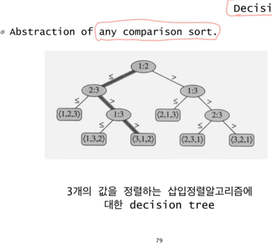

# 정렬의 lower bound

- bubble
- selection
- insertion
- quick
- merge
- heap

정렬 중에 merge , heap 정렬이 nlog(n)으로 가장 빠르다.

근데 nlog(n)이 최선인가?

최선이다.!

단 Comparison sort 라는 조건이 있을 때에만

- Comparison sort
    - 데이터들간의 상대적 크기관계만을 이용해서 정렬하는 알고리즘
    - 따라서 데이터들간의 크기 관계가 정의되어 있으면 어떤 데이터에든 적용가능(문자열, 알파벳, 사용자 정의 객체 등)
    - 버블소트, 삽입정렬, 합병정렬, 퀵소트,  힙정렬 등
    
- Non-comparison sort
    - 정렬할 데이터에 대한 사전지식을 이용 - 적용에 제한
    - Bucket sort
    - Radix sort
    

어떤 comparison sort도 nlog(n) 보다 낮을 수는 없다.

- 하한(Lower bound)
    - 입력된 데이터를 한번씩 다 보기위해서 최소 o(n)의 시간복잡도가 필요
    - 합병정렬과 힙정렬 알고리즘들의 시간복잡도는 o(nlogn)
    - 어떤 comparison sort 알고리즘도 O(nlogn)보다 나을 수 없다.

## Decision Tree

