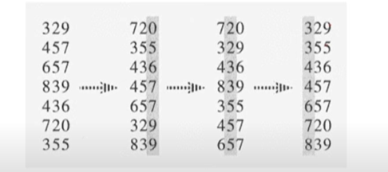

# Radix Sort

- n개의 d자리 정수들
- 가장 낮은 수부터 정렬

**_Stable Sort_**:
정렬을 할 때 입력으로 들어온 데이터 중에 동일한 데이터가 2개 이상 있을 때 최종 정렬을 출력 할 때
동일한 데이터의 순서가 유지 되는 것

Radix Sort에서는 Stable Sort가 유지되어야 한다.
두번 째 자리의 수를 기준으로 정렬할 때 720, 329는 두번째 자리의 수가 2로 정렬 앞 쪽으로 오게
되는데, 이때 729가 원래 제일 앞에 위치 하고 있기 때문에 정렬하는 과정에서 729와 329의
순서가 바뀌면 안된다.

