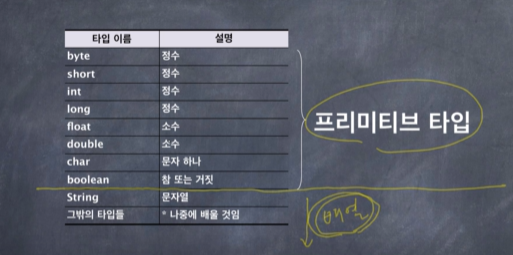

```java
public class Code13_2 {

    public static void main(String[] args) {

        Scanner kb = new Scanner(System.in);

        int i = kb.nextInt();

        int  [] data = new int [i];

        for (int k=0; k<i; k++)
            data[k] = kb.nextInt();

        kb.close();

        bubbleSort(data);

        System.out.println("Sorted data");

        for (int k=0; k< i; k++)
            System.out.print(data[k] + "  ");

    }

    private static void bubbleSort(int []data) {

        for (int i= data.length-1; i>0; i--){
            for (int j=0; j<i; j++){
                if (data[j]>data[j+1]){

                    swap(data[j], data[j+1]);
                }
            }
        }

    }
    private static void swap(int datum, int datum1) {
               int tmp = datum1;
                datum1=datum;
                datum = tmp;
    }

}
```

버블정렬에서 swap하는 로직을 메서드로 구현하면

정렬이 되지 않는다. 왜냐하면 값에 의한 호출로 

data[j], data[j+1]이 swqp 함수의 datum .datum1로 각 각 값이 복사 되어서

swqp 로직이 잘 이루어졌다. 하지만 이것은 datum, datum1이 swap 된 것이지

data[j] , data[j+1]이 swqp 된것이 아니기 때문이다.

즉, 복사된 datum , datum1 과 data[j] , data[j+1]은 별개의 변수이다.

그런데,

````java
 bubbleSort(data);


        private static void bubbleSort(int []data) {

        for (int i= data.length-1; i>0; i--){
        for (int j=0; j<i; j++){
        int tmp;
        if (data[j]>data[j+1]){
        tmp = data[j+1];
        data[j+1]=data[j];
        data[j] = tmp;
        }
        }
        }

        }
````

여기서는 배열 data가 함수 매개변수로 넘어가서 로직을 수행한뒤

정렬된 배열로 변경이 잘 이루어졌다.

왜 그럴까?

그건 primitive 타입이냐 아니냐의 차이 때문이다.


### 매개변수
- 프리미티브(primitive) 타입의 매개변수는 호출된 메서드에서 값을 변경하더라도 호출한 쪽에 영향을 주지 못한다.
이것은 "값에 의한 호출"이기 때문이다.
  
- 배열의 값은 호출된 메서드에서 변경하면 호출한 쪽에서도 변경된다.
- 비일관성?



배열은 primitive 타입이 아니다.