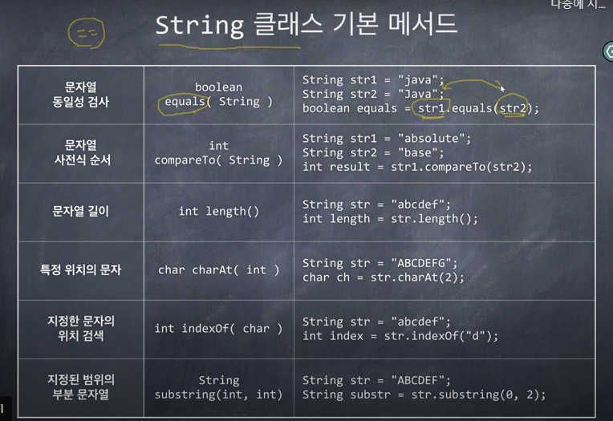

#### 인덱스 메이커

- 입력으로 하나의 텍스트 파일을 읽는다(sample.txt)
- 텍스트 파일에 등장하는 모든 단어들의 목록을 만들고, 각 단어가 텍스트 파일에
  등장하는 횟수를 센다. 단, 단어 개수는 100,000개 이하라고 가정한다.

- 사용자가 요청하면 단어 목록을 하나의 파일로 저장한다.
- 사용자가 단어를 검색하면 그 단어가 텍스트 파일에 몇 번 등장하는지 출력한다.

