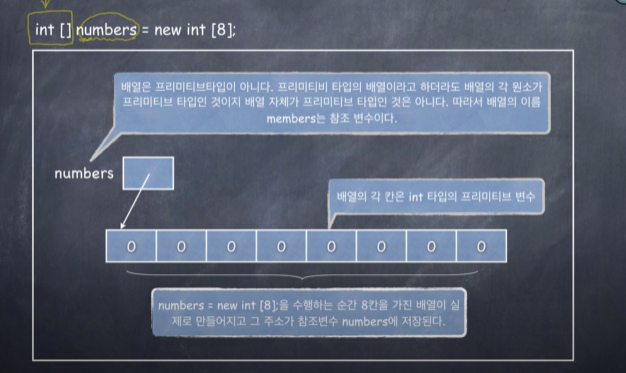
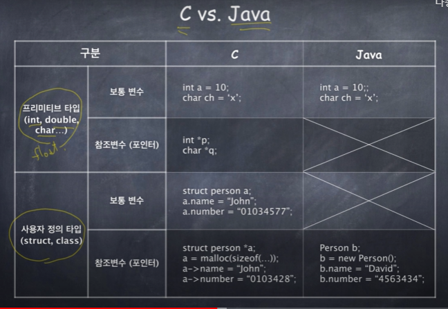

`강의 : 클래스,객체,참조변수(2/5)`


모든 프리미티브 타입의 변수는 보통 변수이다.
즉 변수 자체에 값이 저장된다.

__프리미티브 타입이 아닌 모든 변수는 참조 변수이다.__

즉 실제 데이터가 저장될 "객체"는 new 명령으로 따로 만들어야 하고,
참조변수에는 그 객체의 주소를 저장한다.


*****
보통 변수와 참조 변수의 차이를 알아야 한다.


******





참고 : int는 프리미티브 타입 , 배열은 프리미티브 타입이 아니다.


```java
 int numbers [] = new int [8];

        numbers[0] = 4;
        numbers[1] = numbers[0];

        numbers[1] = 10;

        System.out.println("numbers[0] = " + numbers[0]);
```

`numbers[0] = 4`

왜냐하면 배열은 프리미티브 타입이 아니라서 참조변수이지만

배열의 각 원소는 프리미티브 타입이기 때문에 보통변수이다.


```java

        Person1 p1 = new Person1("건희","1번");
        Person1 p2 = new Person1("건오","2번");

        Person1 [] people = new Person1[5];

        people[0] = p1;

        p2 = p1;
        people[1] = p2;

        p2.name = "박건희";

        people[2] = p2;

        System.out.println("people => " +people[0].name + " " + people[0].number);
        System.out.println("people => " +people[1].name + " " + people[1].number);
        System.out.println("people => " +people[2].name + " " + people[2].number);
        

        
```

```
people => 박건희 1번
people => 박건희 1번
people => 박건희 1번
```

배열도 참조변수 , 배열의 원소도 참조 변수 이기 때문에

p1과 p2가 하나의 객체를 참조하고 있고

각 원소도 하나의 객체를 참조하고 있기 때문에

people[2]도 바뀌는 것이 아니라

모든 원소도 값이 변경되었다.


```java
 people[3].name = "코니";
```

이렇게 하면 NullPointerException이 발생한다.

왜냐하면 참조변수이기 때문에 각 각 배열의 원소는 Person1이라는
객체의 주소가 저장되어야 하기 때문이다.

즉, people[3]에는 어떠한 객체 주소도 지정해주지 않았다

```java

        people[3] = new Person1();
        people[3].name = "코니";
```

즉 먼저 객체의 주소를 넣어주어야한다.


